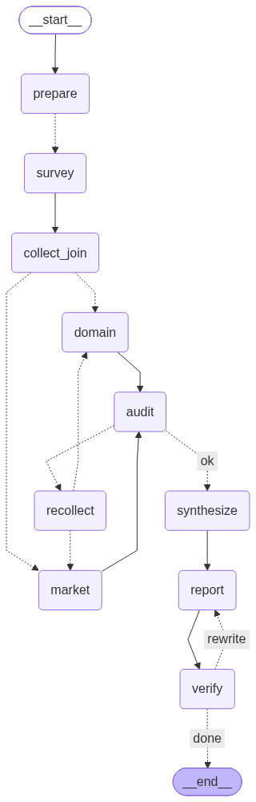

# Subject

본 프로젝트는 KV cache 최적화 기술을 소프트웨어, 하드웨어 두 진영에서 하나씩 선정하여
시장성 관점과 도메인 적용 관점에서 평가하는 Multi-Agent + Agentic RAG를 개발하는 프로젝트 임.

평가의 목적은 두 기술의 우열을 가리는 것이 아니라, 같은 병목을 상반된 방식으로 푸는 두 기술이
관점에 따라 어떻게 다르게 읽히는지를 드러내는 것임.

> 1인 과제 범위 한정 사항
> - 기술 선정은 2안(직접 선정)으로 진행. 에이전트가 기술을 고르지 않음.
> - 네 관점 중 **2. 시장성 관점**과 **4. 도메인 적용 관점**만 대상. 기술 성숙도(TRL) 관점과
>   이해관계자 관점은 범위에서 제외.
> - 개발 산출물만 제출. 설계 산출물은 대상이 아니나, 설계 근거는 본 README와 코드 주석에 기록.

## Overview

- Objective : 하나의 병목(KV cache)을 상반된 방식으로 푸는 두 기술을 복수 관점에서 비교 평가
- Method : Multi-Agent(Distributed fan-out) + Agentic RAG(관련성 판정과 재검색 루프)
- Tools : LangGraph, FAISS 대체 자체 하이브리드 검색기(RRF), BM25, Tavily Web Search, PyMuPDF

## Selected Technologies

- **SW : DeepSeek-V2 MLA (Multi-head Latent Attention)** — 소프트웨어 진영에서 가장 근본적인
  형태를 고름. 사후 압축이 이미 만들어진 KV cache를 줄이는 것과 달리 MLA는 어텐션 구조 자체를
  바꿔 처음부터 작게 나오게 함. 진영 내 최대 압축률(93.3%)을 보고했고 실제 상용 모델에 배포되어
  시장 근거를 수집할 수 있음.
- **HW : ITME (Inference Tiered Memory Expansion with Disaggregated CXL-Hybrid Memories)** —
  하드웨어 진영에서 분류가 흔들리지 않는 것을 고름. 같은 Doc Pool의 InfiniGen은 기존 하드웨어
  위에서 동작하는 소프트웨어 기법이라 SW 대 HW 비교 축이 흐려짐. ITME는 CXL 메모리라는 새
  하드웨어 계층을 전제하므로 진입 비용의 성격이 MLA와 정확히 대비됨.

선정 기준은 **진입 비용의 대칭성**임. MLA는 하드웨어를 그대로 두는 대신 모델을 처음부터 다시
학습해야 하고, ITME는 모델을 그대로 두는 대신 새 메모리 하드웨어를 들여야 함. 같은 병목을 두고
무엇을 바꿀 것인지가 정반대라서, 우열을 판정하지 않고도 관점에 따라 평가가 갈리는 모습을
드러낼 수 있음.

제외한 후보와 사유는 `config.py`의 `NOT_SELECTED`에 기록.

## Features

- **PDF 자료 기반 정보 추출** — 2단 조판 논문의 열 뒤섞임을 자동 감지해 열 단위로 읽음.
  단어 붙음 비율이 0.033에서 0.016으로 감소(`eval/loader_probe.py`).
- **질의 현지화** — 문서는 영문 논문이고 질의는 한국어임. 검색 전에 질의를 영어로 옮김.
  실측상 이 조치가 임베딩 모델 선택보다 효과가 큼(아래 Tech Stack 참조).
- **Agentic RAG 재시도** — 관련성 판정이 실패하면 같은 질의로 다시 검색하지 않고 k를 넓힌 뒤,
  그래도 안 되면 질의를 다시 씀.
- **웹 검색 분리** — 논문에 있을 수 있는 사실은 웹으로 넘어가지 않음. 시장 채택 현황처럼 논문에
  있을 수 없는 항목에만 웹을 염. 웹 근거에는 쪽수를 붙이지 않음.
- **근거 원장** — 모든 평가 문장이 근거 id를 가리킴. 근거를 못 대는 문장은 검증 단계에서 탈락.
- **확증 편향 방지 전략**
  1. 대칭 질의 : 두 기술에 같은 질문 템플릿을 적용하고 기술 이름만 교체
  2. 찬반 대칭 수집 : 관점마다 유리한 근거와 불리한 근거를 각각 별도 질의로 수집
  3. 순서 효과 제거 : 기술 제시 순서를 뒤집어 두 번 실행하고 결론 차이를 기록(`app.py compare`)
  4. 근거 강제 : 근거 id 없는 문장 제거
  5. 수치 대조 : 보고서의 숫자가 근거 원문에 있는지 코드로 대조
  6. 우열 표현 금지 : 금지어 목록을 두고 검사
  7. 감사 노드 : 찬반 근거 개수와 두 기술 간 근거량 불균형을 세어 한쪽으로 기울면 재수집

## Tech Stack

- Framework : LangGraph 1.0
- LLM/Generator : gpt-4.1-mini
- LLM/Judge : gpt-4.1 (종합, 보고서 생성)
- Retrieval : 자체 하이브리드 검색기 (조밀 코사인 + BM25, RRF 융합) — 지표는 아래 표
- Embedding : **BAAI/bge-m3** (오픈소스)

### 임베딩 모델 선정 근거

리더보드 순위로 고르지 않음. 이 과제의 검색 조건이 일반 벤치마크와 다르기 때문임. 문서는 영문
논문이고 질의는 한국어이며, 찾아야 하는 것은 문장의 주제가 아니라 표 안의 수치와 약어임.

질의 20개와 사람이 고른 정답 문자열로 직접 측정(`eval/embed_bench.py`).

| 모델 | 파라미터 | 색인(초) | 한국어 질의 Hit@5 | 한국어 하이브리드 Hit@5 | 영어 질의 Hit@5 | 영어 하이브리드 Hit@5 | 영어 하이브리드 MRR |
|---|---|---|---|---|---|---|---|
| **BAAI/bge-m3** | 568M | 24.6 | 0.85 | 0.55 | 0.95 | **0.95** | **0.930** |
| nlpai-lab/KURE-v1 | 568M | 24.3 | 0.80 | 0.55 | 0.95 | 0.95 | 0.897 |
| intfloat/multilingual-e5-large | 560M | 24.2 | 0.75 | 0.50 | 0.95 | 0.95 | 0.880 |
| paraphrase-multilingual-MiniLM-L12-v2 | 118M | 6.9 | 0.65 | 0.50 | 0.75 | 0.85 | 0.807 |

측정에서 나온 사실 세 가지가 설계를 바꿈.

1. **질의를 영어로 옮기면 상위 세 모델이 Hit@5 0.95로 수렴함.** 모델을 바꾸는 것보다 질의 언어를
   문서 언어에 맞추는 것이 효과가 큼. 그래서 검색 파이프라인에 질의 현지화 노드를 넣음.
2. **한국어 질의에서는 하이브리드가 오히려 점수를 깎음**(bge-m3 기준 0.85에서 0.55). BM25가
   한국어 어절로 영문 문서를 때리면 잡음만 더해짐. 영어 질의에서는 반대로 MRR을 0.867에서
   0.930으로 올림. 하이브리드를 무조건 쓰지 않고 현지화 뒤에 쓰는 이유임.
3. **한국어 특화 모델인 KURE-v1이 한국어 질의에서 bge-m3보다 낮게 나옴**(0.80 대 0.85).
   한국어 특화라는 계보만 보고 고르면 틀렸을 선택임.

최종적으로 bge-m3를 선택한 이유는 영어 질의 하이브리드 MRR이 0.930으로 가장 높기 때문임.
Hit@5는 상위 세 모델이 같지만, 이 파이프라인은 상위 근거 몇 개만 LLM에 넣어 평가문을 쓰므로
순위 품질이 곧 평가 품질이 됨. 경량 모델(118M)은 색인이 3.5배 빠르지만 MRR이 0.807로 떨어져,
색인을 한 번만 수행하는 이 과제에서는 속도 이점이 크지 않다고 판단함.

## Agents

| 에이전트 | 역할 | RAG | 근거 출처 |
|---|---|---|---|
| 기술 조사 | 논문 원문에서 접근 방식, 보고 수치, 성립 조건, 저자가 밝힌 한계를 추출 | O | 문서 풀만 |
| 시장 평가 | 채택 폭과 깊이, 진입 비용, 생태계 지지, 시장 수치를 조사 | O | 문서 풀 + 웹 |
| 도메인 평가 | 주 도메인 적합성과 대조 도메인 전환 시 변화를 조사 | O | 문서 풀 + 웹 |
| 평가 종합 | 두 관점이 엇갈리는 지점과 도메인 전환 시 뒤집히는 지점을 추출 | X | 앞 단계 결과 |
| 보고서 생성 | 10쪽 제한 보고서 작성 | X | 앞 단계 결과 |

에이전트를 나눈 기준은 **무엇을 근거로 삼는가**임. 근거의 출처가 같은 일을 한 에이전트에 묶어
두면 검증할 지점이 한 곳으로 모임. 범위에서 제외된 기술 성숙도 에이전트와 이해관계자
에이전트는 구현하지 않음.

## Architecture



병렬 구간이 둘임. 기술 조사는 두 기술이 서로를 보지 않고 동작함. 한쪽 결과를 보고 다른 쪽을
조사하면 먼저 본 쪽이 기준이 됨. 관점 평가도 시장성과 도메인이 서로를 참조하지 않음. 겹치는
내용은 종합 단계에서 연결함. State는 관점별로 키를 분리하고 기술 id를 하위 키로 두어 병렬
갱신이 서로를 덮어쓰지 않도록 함(`state.py`).

되돌아가는 길도 둘임. 감사가 한쪽 근거만 모였다고 판정하면 모자란 쪽을 다시 수집하고, 검증이
막히면 보고서를 다시 씀. 두 경로 모두 상한을 두어 무한 반복을 막음.

검색 서브그래프(`docs/retrieval_subgraph.mmd`)는 세 에이전트가 공유함.

## Directory Structure

```
├── data/
│   ├── papers/            # Doc Pool 원문 PDF
│   └── pool.json          # 문서 풀 정의. 200쪽 제한을 실행 시 검사
├── agents/
│   ├── retrieve_loop.py   # Agentic RAG 검색 서브그래프
│   ├── queries.py         # 대칭 질의 템플릿
│   └── nodes.py           # 에이전트 노드
├── rag/
│   ├── ingest.py          # 2단 조판 인식 PDF 로더와 청킹
│   ├── embedder.py        # 오픈소스 임베딩 래퍼
│   └── retriever.py       # 조밀 + BM25 하이브리드, RRF 융합
├── eval/
│   ├── loader_probe.py    # 로더 비교 실측
│   ├── embed_bench.py     # 임베딩 후보 비교 실측
│   └── queries.json       # 정답 문자열이 붙은 검색 질의 20건
├── tools/
│   ├── draw_graph.py      # 그래프 다이어그램 출력
│   └── md2pdf.py          # 보고서 PDF 변환과 쪽수 검사
├── outputs/               # 보고서와 실행 State
├── config.py              # 평가 대상, 관점별 기준, 편향 방지 장치
├── state.py               # State 스키마
├── graph.py               # 그래프 조립
└── app.py                 # 실행 스크립트
```

## Usage

```bash
uv sync --python 3.11
cp .env.example .env          # OPENAI_API_KEY, TAVILY_API_KEY 입력

python app.py index           # 문서 풀 색인. 한 번만
python app.py run             # 평가 실행, 보고서 생성
python app.py run --seed 1    # 기술 제시 순서를 뒤집어 재실행
python app.py compare         # 두 실행의 결론이 갈리는지 비교

python eval/embed_bench.py    # 임베딩 후보 실측 재현
python tools/md2pdf.py outputs/report_seed0.md   # PDF 변환과 쪽수 검사
```

## Contributors

- (이름) : 전 과정 단독 수행. 기술 선정, 문서 풀 구성, RAG 파이프라인 설계 및 구현,
  에이전트 설계 및 구현, 평가 기준 설계, 확증 편향 방지 장치 구현, 보고서 생성 및 검증
